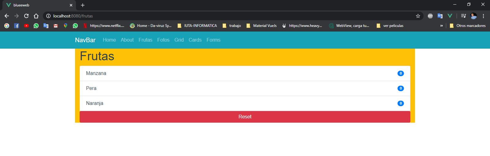
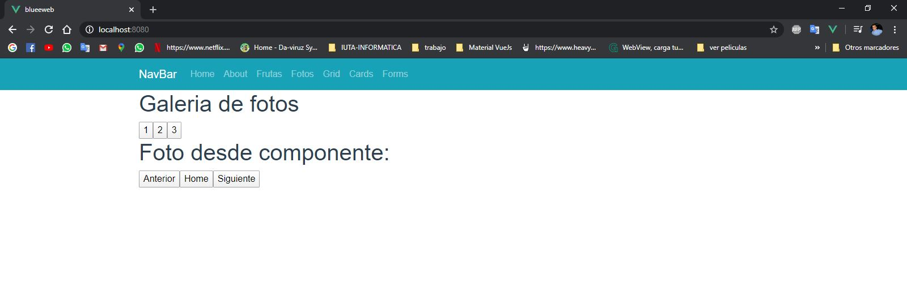
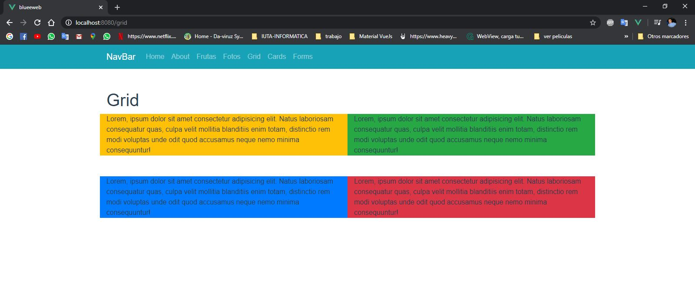
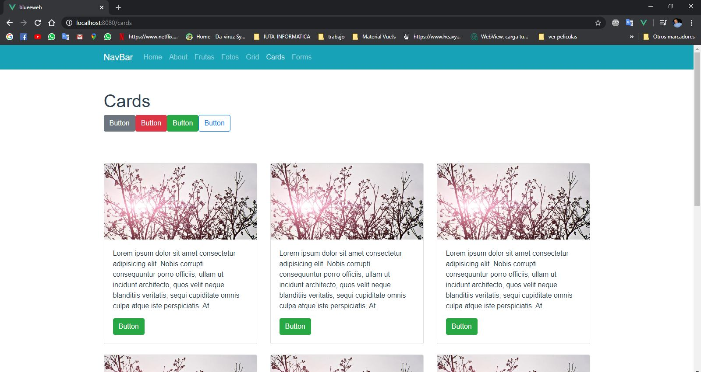
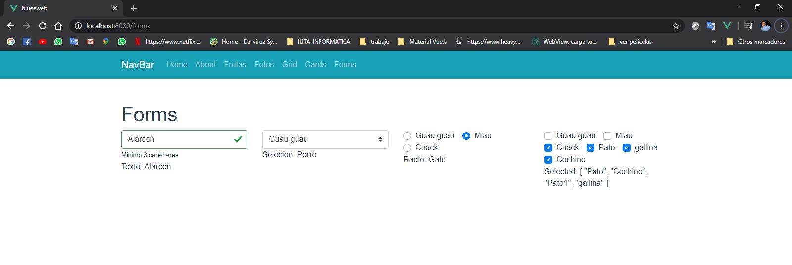

# blueeweb
Proyecto creado para plasmar el progreso del aprendisaje Vuejs, Vuex, Router-Vue, Bootstrap-vue.

-En el se coloca en practica tecnicas vuex para poder centralizar componentes (Frutas). 

-Rutas dinamicas con Router-Vue (Fotos).

-Grind (Grid), Tarjetas (Cards), Formulario con validaciones; Selecteds; Radio; Checkboox con seleccion en array; 


## Project setup
```
npm install
```

### Compiles and hot-reloads for development
```
npm run serve
```

### Compiles and minifies for production
```
npm run build
```

### Lints and fixes files
```
npm run lint
```

### Customize configuration
See [Configuration Reference](https://cli.vuejs.org/config/).

### ScreenShot

#### Frutas


#### Fotos


#### Grid


#### Cards


#### Froms
